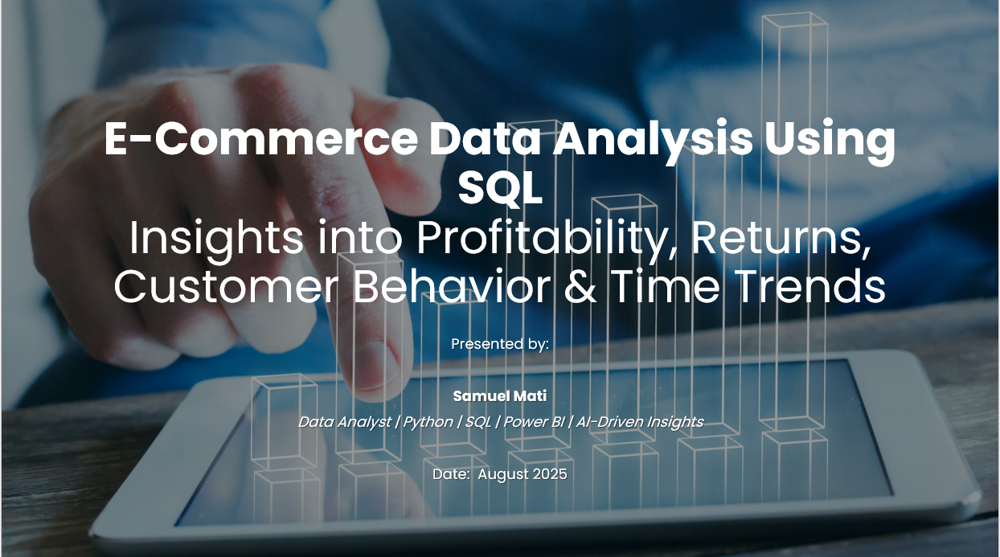

# 📊 E-Commerce Profitability Analysis Using SQL

Welcome to this exploratory data project where I analyzed an e-commerce dataset to uncover insights about **profitability, customer behavior, returns, shipping efficiency, and discount impact** — all through SQL.

---

## 🚀 Project Overview

This project uses **pure SQL** to answer practical business questions faced by e-commerce companies. From identifying unprofitable products to analyzing the effect of returns and shipping delays, the project reveals data-driven insights that can drive better business decisions.

All queries were written in MySQL-style syntax and can be run inside a SQL environment, or adapted into a Jupyter Notebook using `sqlite3` or `pandasql`.

---

## Key Business Questions Answered

✅ Which products and categories are **consistently unprofitable**?  
✅ How do **discounts impact profit margins** across orders?  
✅ Are **certain shipping modes** causing more **delivery delays**?  
✅ What is the **return rate**, and how do returns affect profitability?  
✅ Are **certain customer segments or product categories** more likely to return products?  
✅ Who are the **top 10 customers by total sales and profit**?  
✅ What are the **monthly and quarterly trends** in sales and profits over time?  
✅ How profitable is each **customer segment**?  
✅ Can we track **dynamic KPIs** like return rate, delivery delay rate, and profit margin across segments?

---

## 🗂Dataset Description

The dataset simulates an e-commerce platform and includes the following fields:

| Column | Description |
|--------|-------------|
| `Order Date` | Date of order placement |
| `Ship Date` | Date the order was shipped |
| `Ship Mode` | Type of delivery method |
| `Customer Name` | Name of the customer |
| `Segment` | Customer category (e.g., Consumer, Corporate, Home Office) |
| `Product Name` | Name of the product ordered |
| `Category` | Product category |
| `Sales` | Revenue generated |
| `Profit` | Profit from sale |
| `Returned` | Whether the item was returned (1 or 0) |
| `Discount` | Discount given on the item |
| `Region` | Geographic region of order |

---

## 🛠️ SQL Techniques Used

- **Common Table Expressions (CTEs)**
- **Aggregations & GROUP BY**
- **Date Functions (YEAR, MONTH, QUARTER, DATEDIFF)**
- **Conditional Logic with CASE**
- **Windowing Metrics like profit margin, return rate, delay rate**
- **NULLIF for safe division (avoiding zero division errors)**

---

## Sample Insights

- Some product categories (especially high-discounted ones) contribute **negatively to overall profit**.
- **Returns** significantly reduce profit margins in the Consumer segment.
- **Standard Class** shipping method has the highest **average shipping delay**.
- Most **profitable customer segment**: Corporate.  
- **Quarter 4** is consistently the highest in terms of **sales volume**.
- Customers in certain **regions consistently return more products**, increasing logistical overhead.

---

## 👤 About Me

I'm **Samuel**, a data analyst passionate about using SQL, Python, and BI tools to solve real business problems.  
I'm currently working with **AReL** in Kakuma, delivering data analytics training — and this project reflects my commitment to practical, real-world analysis.

Connect with me on [LinkedIn](https://www.linkedin.com/in/samuel-mati) | Portfolio projects coming to [GitHub](https://github.com/samuel-mati)

---

## ⭐ If You Found This Interesting...

- Give this project a ⭐ star
- Fork it, try your own analysis
- Tag me if you share or build on it!
